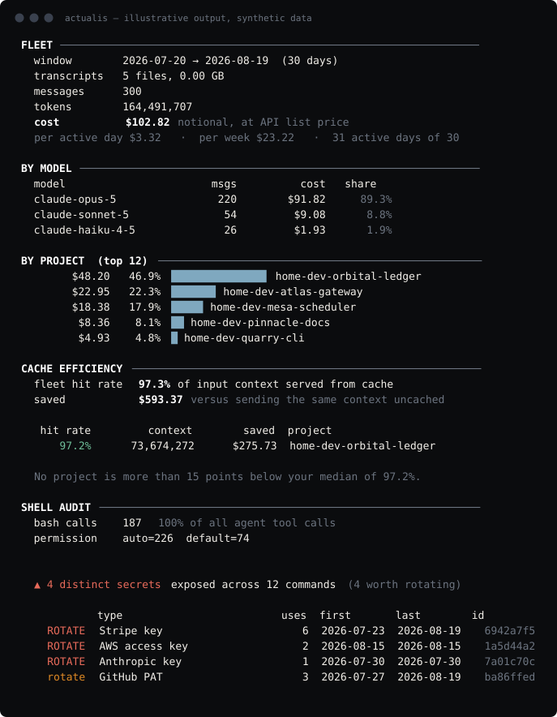

# ACTUALIS

**What actually ran.**

[actualis.app](https://actualis.app) · [Latest release](https://github.com/digital-foundry/actualis/releases/latest) · [Changelog](CHANGELOG.md) · [Security policy](SECURITY.md) · [Trade marks](TRADEMARKS.md)

Your coding agent writes down everything it did — every shell command, every
token, every refused tool call — and then nothing reads it. `actualis` reads it.

```sh
uv tool install actualis     # or: pipx install actualis
actualis
```

No account, no config file, no network. It reads files already on your disk
and prints a report, across **Claude Code** and **Codex** together.

**What it finds that you probably don't know:**

- **Credentials that ended up in shell commands** your agent ran, grouped by
  fingerprint and ranked for rotation. The value itself is never printed or
  stored — only a hash of it.
- **Every command the agent ran**, audited for the risky shapes: `rm -rf`,
  piped installers, credential reads, egress to somewhere new.
- **What happened while a credential was live.** Give it one fingerprint and
  it reconstructs the incident: the exposure window, every command that ran
  inside it, and the subset worth actually reading. A four-day window holds
  thousands of commands; graded by proximity it is usually a few dozen.
- **What was refused, and by whom** — you, or the auto-approval policy. A
  refused command is never sent to a provider, so nothing watching the API can
  see it. It exists only on your disk.
- **What it cost**, per project, per model, per ticket — counted once per
  billable message, not once per transcript record. A transcript re-emits the
  same assistant record while a response streams; counting those repeats
  overstated my own fleet's spend by 2.13×.

### Don't trust it. Check it.

```sh
actualis --self-check
```

The claims above are the product, so the tool verifies them on your machine
instead of asking you to believe them: which modules the shipped source
imports at any depth, your transcripts hashed before and after a real scan to
show they are byte-identical, nothing created or deleted, the only path it can
write to, and its own sha256 to compare against the published wheel. It also
prints what it does **not** prove. [More on privacy](#privacy).

One file, no third-party dependencies, AGPL-3.0. If you are about to point
something at your session history, you should be able to read it in a sitting.

<p align="center">
  
</p>

<p align="center"><sub>Illustrative output from a synthetic fleet — every project, branch and
credential above is invented. Regenerate with <code>tools/make-demo-fleet.py</code>.</sub></p>

```
$ actualis

FLEET ──────────────────────────────────────────────────────────────
  window        2026-05-04 → 2026-06-04  (31 days)
  transcripts   168 files, 0.4 GB
  messages      38,204
  cost          $12,480.55 notional, at API list price
  per active day $402.60   ·  per week $2,818.20   ·  31 active days of 31

BY PROJECT ─────────────────────────────────────────────────────────
    $10,159.17   81.4% ███████████████████████████ web-app
     $1,385.34   11.1% ███ api-service
       $87.36    0.7%  data-pipeline

  ▲ 81% of all spend is one project: web-app

SHELL AUDIT ────────────────────────────────────────────────────────
  bash calls    13,006  73% of all agent tool calls
  permission    auto=7,140  default=402  acceptEdits=377  plan=14
  denied        automode-blocked=58  user-rejected=31

  ▲ 1,315 commands contained credential material
  flagged   340 high   148 medium   of 13,006 commands
```

## One credential, one incident report

The report tells you a credential was exposed. It cannot tell you what happened
while it was live, which is the only question worth asking next.

```sh
actualis --replay 7c31dab8        # the id from the credential table
actualis --replay 7c31dab8 --json # an incident record
```

Given one fingerprint it reconstructs the exposure window, then every command
that ran inside it — **graded by proximity, not by clock overlap**:

| | |
|---|---|
| **same session** | had the credential in that session's context |
| **same project** | other sessions in the same project |
| **elsewhere** | overlapped in time only, reported for completeness |

then narrows to the commands worth actually reading: in-session commands that
touch egress, credentials or a database.

That grading is the point. On a real corpus a four-day exposure window contains
7,553 commands, and counting them all produces a number nobody can act on. The
same incident graded by proximity is **42 commands to read**.

Works across Claude Code and Codex. Codex records no git branch, so those stay
empty rather than invented.

Every report ends with what it does **not** establish — including that absence
of a sighting after `last_seen` is not evidence of rotation.


## What it answers

Terminal-native coding agents write a complete record of every session to your
disk: token usage per turn, every tool call, every shell command. What they
don't give you is a view across all of it. If you run agents in more than one
project, or more than one agent, you cannot currently answer:

- What did my agents cost last month?
- Which project is burning the budget?
- What did issue #412 cost?
- What shell commands have my agents actually been running?
- Did a credential ever end up in a command?

`actualis` answers all five from data already on your machine, in one report.

## Install

No dependencies beyond Python 3.9+. Either run the file directly:

```sh
python3 actualis.py
```

Or install it as a command:

```sh
uv tool install .      # or: pipx install .
actualis
```

`uv tool install` copies the code, so re-run it with `--force` after pulling to
pick up changes.

## Usage

```sh
python3 actualis.py                  # full report
python3 actualis.py --days 30        # last 30 days
python3 actualis.py --bash           # shell audit only
python3 actualis.py --coach          # findings and recommended actions only
python3 actualis.py --watch          # live alerting on new secrets
python3 actualis.py --project svc    # filter to matching projects
python3 actualis.py --json           # machine-readable
python3 actualis.py --top 25         # show more projects
python3 actualis.py --agent codex    # one agent only (claude | codex | all)
```

### All options

| flag | effect |
|---|---|
| `--days N` | only the last N days |
| `--project SUBSTR` | only projects whose name contains SUBSTR |
| `--top N` | how many projects and tickets to list (default 12) |
| `--agent {all,claude,codex}` | which agents to include (default all) |
| `--root DIR` | read one specific transcript directory instead of discovering them |
| `--bash` | shell audit only |
| `--coach` | findings and actions only |
| `--aisvs` | which OWASP AISVS controls your transcripts show are **not** holding |
| `--share` | postable summary with nothing identifying in it |
| `--json` | machine-readable ([schema](docs/json.md)) |
| `--diff OLD.json` | compare against a saved `--json` report: what appeared, what went away, what got worse |
| `--watch` | live monitor; alert on new secrets and risky commands |
| `--interval SEC` | `--watch` poll interval, default 4 |
| `--quiet` | `--watch`: notify on secrets only, not every flagged command |
| `--no-redact` | **do not** redact credentials from output; unsafe to share |
| `--suppress ID` | mark a finding as a false positive on this machine (it stays counted) |
| `--reason TEXT` | why that suppression is correct, recorded for review |
| `--suppressions` | list current suppressions and where they are read from |
| `--fail-on LEVEL` | exit 3 if any unsuppressed finding is at or above `critical`, `high` or `any`. For gating a pipeline |
| `--explain [TOPIC]` | how a number is computed, what it assumes, how to check it |
| `--replay ID` | incident report for one credential: what ran while it was live, graded by proximity |
| `--why AFxxx` | explain one finding against your actual numbers |
| `--agents` | installed agent platforms and whether their binaries are validly signed |
| `--mcp` | run as an MCP server over stdio ([below](#ask-the-agent-about-itself)) |
| `--service KIND` | print a `launchd`, `systemd` or `newsyslog` unit for `--watch`, paths already resolved |
| `--self-check` | verify the privacy claims on your own machine, by executing them. Honours `--root` and `--days` |
| `--completions SHELL` | print a shell completion script for `bash`, `zsh` or `fish` |
| `--version` | print version |

### Completions

The script is generated from the parser, so it never drifts from the flags this
build actually has. `--explain`, `--why`, `--agent` and `--fail-on` complete
their real values.

```sh
# zsh — any directory on your fpath
actualis --completions zsh > ~/.zsh/completions/_actualis

# bash
actualis --completions bash > ~/.local/share/bash-completion/completions/actualis

# fish
actualis --completions fish > ~/.config/fish/completions/actualis.fish
```

Regenerate after upgrading. `--suppress` is deliberately not completed: its
values are finding ids from your own report, and producing them needs a full
scan — a tab key that hangs the terminal is worse than one that does nothing.

### What the report contains

`FLEET` totals and sources · `TOKENS` broken out by cache bucket with the
multiplier applied to each · `BY AGENT` · `BY MODEL` · `CACHE EFFICIENCY` ·
`BY TICKET` · `TOOL CALLS` · `SUBAGENTS` · `SHELL AUDIT` · `COACH`.

## Documentation

| | |
|---|---|
| [docs/findings.md](docs/findings.md) | every coach finding `AF001`–`AF011`: what it means, when it fires, what to do |
| [docs/secrets.md](docs/secrets.md) | which credential types are detected, and what is deliberately not flagged |
| [docs/json.md](docs/json.md) | `--json` schema |
| [CONTRIBUTING.md](CONTRIBUTING.md) | ground rules, and the CLA note that keeps dual licensing possible |
| [SECURITY.md](SECURITY.md) | what counts as a vulnerability, and how to report one |
| [CHANGELOG.md](CHANGELOG.md) | what changed |

## Cost per ticket

Branch names almost always carry the issue number, so the same data that answers
"what did this project cost" also answers **"what did issue #412 cost"** — the
unit engineering and finance already budget in.

```
BY TICKET  (top 5 of 58)
         cost  ticket         msgs   days  where
    $1,884.10  #412        3,110      5  feat/412-checkout-v2, feat/412-checkout-api +1
    $1,102.40  #310         1,240      2  fix/310-session-timeout
    $980.25  #907         1,206      2  feat/907-export-queue

  $8,140.20 across 58 tickets (12 spanning several branches) · $3,890.15 on trunk
```

One ticket often spans several branches, so grouping by ticket rather than branch
is the point. `feat/412-p4-…`, `p5-…` and `p6-…` are one number. Work on trunk or
in a detached HEAD is reported separately rather than guessed at.

Recognised: `feat/412-slug`, `fix/310-slug`, `PROJ-456`, `feature/PROJ-456`,
`issue-742`, `gh_91`, `412-slug`. Anything else is left unattributed rather than
invented.

## The coach

The report says what happened; `--coach` says what to do about it. Findings carry
stable ids (`AF001`–`AF010`) so they can be quoted and documented, and each one
carries evidence, an action, and an impact estimate where one can be computed
honestly.

**Benchmarks are computed against you, not against other users.** Project versus
project, week versus week, ticket versus your median ticket. That needs no
telemetry, no account, and no population — it works on day one with one user, and
it keeps the no-network promise intact.

Findings are earned. On a fleet with nothing notable, the coach prints nothing.

Full reference: [docs/findings.md](docs/findings.md).

## Cache efficiency

```
CACHE EFFICIENCY
  fleet hit rate  98.1% of input context served from cache
  saved           $71,905.40 versus sending the same context uncached

   hit rate         context        saved  project
      97.4%  14,220,551,900  $58,110.20  web-app
      96.9%   2,140,882,003   $8,795.15  api-service
      96.1%     412,660,004    $1,102.30  data-pipeline

  No project is more than 15 points below your median of 96.1%.
```

Hit rate is `cache_read / (input + cache_write + cache_read)` — the share of
**input context** served from cache. Output tokens are excluded because they are
not cacheable, and including them makes a chatty project look broken when its
caching is fine.

Savings are measured against the counterfactual of sending the same context
uncached, priced per model at the message level. Note that a project doing mostly
cache *writes* can show negative savings, since a 1-hour write costs 2.00x. That
is reported rather than clamped to zero.

A project more than 15 points below your own median is flagged (`AF002`) as
likely having something unstable early in its prompt prefix. Projects below the
reporting threshold are excluded from both the table and the coach, so the two
never disagree.

## Subagents

Subagent runs are reported separately: how many, which models, how much shell and
edit activity, wall-clock, and lines changed.

```
SUBAGENTS
  214 runs · 18.4 hours wall-clock · 38,910 lines added, 6,204 removed
       151  claude-sonnet-5
        34  claude-haiku-4-5
        22  claude-opus-4-8[1m]

  tool activity  bash 3,402 · read 1,188 · edit 820
  cost floor     $16.44 — a LOWER BOUND, excluded from the headline figure
```

**Their cost is a floor, not a total, and it is kept out of the headline number.**
The parent transcript records only each run's final message: `totalTokens` equals
the sum of that single `usage` object in 873 of 873 observed cases, and scales
about 2x from a 4-tool run to a 45-tool run, which is context growth rather than
summation. The cumulative spend of a subagent's turns is not recoverable, so it is
not estimated.

**The bigger finding is what the audit cannot see.** 3,402 shell commands ran
inside subagents — 21% of all shell activity — and their command text is never
written to the parent transcript. Subagents inherit the parent's permissions but
not its visibility. The shell audit says so explicitly rather than reporting a
number that looks complete.

## Sharing a summary

`--share` prints a postable summary containing nothing that identifies you: no
project names, branches, ticket ids, paths, commands, or fingerprints. Only
totals, rates, distributions, and generic finding titles.

```
  actualis · what my coding agents cost and did

  31 active days   2 agent(s)   38,204 messages   17,540,882,110 tokens

  $12,480.55 at API list price   ·   $402.60/active day
  98.1% of input context from cache, saving $71,905.40 against sending it uncached
  81% of spend in a single project
  $41.20 median cost per ticket, over 58 tickets

  13,006 shell commands   73% of all tool calls
  92% of turns ran unsupervised
  21% of shell activity happened inside subagents, where commands are not recorded
  19 distinct credentials found in command history   6 critical, 18 worth rotating

  coach   AF004  AF003  AF005  AF011  AF001  AF007  AF008  AF009
```

The test suite plants identifying strings — a project name, a branch, a path, a
live-shaped key, an internal hostname — and asserts that none of them can reach
this output. Secret fingerprints are excluded too, since a hash is still an
identifier that could be correlated.

## Nothing is a black box

Every figure is answerable: where it came from, how it was computed, what it
assumes, and how to check it **without trusting this tool**.

```sh
actualis --explain            # list the topics
actualis --explain cost       # the formula, the assumptions, an independent check
actualis --why AF005          # why one finding fired, with your actual numbers
```

Topics: `sources`, `cost`, `cache`, `tickets`, `secrets`, `subagents`, `shell`,
`coach`, `agents`.

Each explanation carries the same four parts, deliberately: what it measures, the
exact formula, what it assumes, and a command that checks the answer some other
way. If a number cannot be interrogated, it should not be acted on.

## Are your agents what they claim to be?

This tool reads what agents did. The obvious next question is whether the agent
itself is genuine — a modified `claude` binary could do anything and still write
a plausible transcript.

```
$ actualis --agents

  OK   Claude Code  claude
       Developer ID Application: Anthropic PBC (Q6L2SF6YDW)
       signature valid, team Q6L2SF6YDW as expected

  OK   Codex  codex
       Developer ID Application: OpenAI OpCo, LLC (2DC432GLL2)
       signature valid, team 2DC432GLL2 as expected

  -    GitHub Copilot CLI  copilot
       no code signature (expected for npm and script installs)
```

| status | meaning |
|---|---|
| `OK` | validly signed by the publisher expected for that tool |
| `WARN` | validly signed, but **not by the expected publisher** |
| `FAIL` | signature present and **invalid — the binary was modified** |
| `-` | unsigned; normal for npm and script installs |
| `?` | signed by an unpinned publisher, or unassessable on this platform |

Team IDs are pinned per tool, so a valid signature from the *wrong* publisher is
visible rather than silently accepted.

**What a valid signature proves:** the binary came from that publisher and has
not been altered since signing. Tested by flipping one byte in a 325 MB signed
binary; it reports `FAIL`. **What it does not prove:** that the software is safe,
or that the publisher deserves trust. **Unsigned is not malicious** — script
based tools are never code-signed.

macOS only. Other platforms report *unassessed* rather than pretending.

## Ask the agent about itself

`--mcp` runs an MCP server over stdio, so the agent producing the data can query
it mid-session: *"what did this ticket cost?"*, *"do I have credentials
exposed?"*

```sh
claude mcp add actualis -- actualis --mcp
```

Five tools: `fleet_summary`, `ticket_cost`, `exposed_secrets`, `coach_findings`,
`shell_audit`.

No port, no daemon, no network — stdio only, and the same read-only local scan
as everything else. Implemented against the standard library rather than the MCP
SDK, because a tool whose pitch is "one auditable file, no supply chain" cannot
take a dependency to speak line-delimited JSON.

**Everything it returns is written back into a transcript** that this tool then
scans, so the surface is deliberately narrow: aggregates, types, fingerprints and
counts. Never a secret value, and never raw command text.

The scan is cached for the life of the process, since a large fleet takes about a
minute to read.

## Privacy

Nothing leaves your machine. No network calls, no telemetry, no analytics, no
config file, no writes. It opens files under `~/.claude/projects` read-only and
prints to stdout. The whole program is one readable file; if you're about to point
a tool at your session history, you should be able to audit it in a sitting, so it
was written to be read.

Those are claims, so the tool checks them for you rather than asking you to
take them on faith:

```sh
actualis --self-check
```

It reads its own source and reports every module it imports (a Python process
cannot open a network connection without `socket`), hashes a sample of your
transcripts before and after a real scan to show they are byte-identical,
confirms no file appeared or vanished under the transcript roots, names the only
path it can ever write to, and prints its own sha256 so you can compare it with
the published wheel. It exits non-zero if any of that fails.

Passing is a floor, not a guarantee, and the output says so: it proves what this
run did, not what every run could do. The stronger check is still to watch the
process yourself, and `--self-check` prints the command for your platform.

Every transcript directory it scanned is printed in the report header. It checks
`~/.claude/projects` **and** `$CLAUDE_CONFIG_DIR/projects`, because a machine can
have both, and a fleet report that silently covers half your fleet is worse than
no report.

## About the cost number

Costs are Anthropic API list prices, verified 2026-08-22, including the cache
multipliers that dominate agent workloads:

| | multiplier on input rate |
|---|---|
| cache read | 0.10× |
| cache write, 5m TTL | 1.25× |
| cache write, 1h TTL | 2.00× |

This matters more than it sounds. On a typical agent workload **97% of all tokens
are cache reads**, so any tool that prices them at the input rate will overstate
your spend by roughly an order of magnitude.

**If you're on a Pro or Max subscription, this is not a bill.** Your actual outlay
is the flat subscription fee. Read the total as *what this would have cost at API
list price*: an opportunity-cost figure, a consumption signal, and a way to see
which project is eating your quota. Models with no published rate are priced at
the top of the known range for their provider, and that share is reported as its
own number so you can subtract it rather than having to trust it.

**One message is counted once.** A transcript repeats the same assistant record
while a response streams — identical message id, identical usage block, a fresh
record uuid each time — so the number of records is not the number of messages.
Versions before 0.1.1 billed every record. On a real corpus of 145,116 usage
records, 50.9% were repeats and the total came out **2.13× too high**: $46,997
reported against $22,064 actual. The report prints how many repeats it collapsed,
so you can see the deduplication working rather than take it on faith. **If you
have a figure from 0.1.0, re-run it.**

## The shell audit

72% of what a coding agent does is run shell commands. That is the largest surface
by far, and it's the one thing an MCP gateway structurally cannot see, because a
gateway sits between the agent and MCP servers and never observes a local `Bash`
call.

The audit is **deterministic**. Plain pattern matching, no model in the loop, no
scoring that drifts between runs. A command either matches a rule or it doesn't,
and you can read every rule in the source. Categories: `destructive`, `privilege`,
`remote-exec`, `credentials`, `egress`, `git`, `publish`, `database`, `audit`.

**A flag means "worth looking at", not "wrong".** Most `rm -rf` calls are a build
directory. The point is that you can see them at all.

The rules were tuned against 48,000 real agent commands, and tuning meant deleting
rules as much as adding them. A rule matching `>/dev/null 2>&1` as "audit
tampering" fired 1,206 times at essentially 100% false positive, so it's gone; a
noisy rule destroys trust in the rules that matter. Current flag rate is about 3.8%.

## Using it in CI

An exit code is the smallest possible integration, and it fits the read-only
promise exactly: the tool returns a verdict and still changes nothing.

```sh
actualis --days 7 --fail-on critical
```

| exit | means |
|---|---|
| `0` | nothing at or above the threshold |
| `1` | could not run: no transcripts, an unreadable `--root` |
| `2` | a command-line usage error (argparse's, not ours) |
| `3` | findings at or above `--fail-on` |
| `130` | interrupted |

Findings are **3**, not 1 and not 2. `1` already meant "could not run", and `2`
is what argparse returns for a bad invocation — a pipeline that cannot tell *a
credential is exposed* from *you mistyped a flag* will eventually be told to
ignore both.

The verdict goes to **stderr**, so `--json` on stdout stays byte-identical and a
pipeline can capture the report and the outcome separately:

```sh
actualis --json --fail-on high > report.json || echo "gate failed"
```

**Suppressed findings do not fail the build.** That is what suppression is for —
if a recorded, reasoned decision still broke CI, people would delete findings
instead of suppressing them. They remain counted in the report, and coach
findings derived from a suppressed credential are suppressed with it.

## When it is wrong

A detector that cries wolf gets ignored, so there is a way to tell it it is
wrong, at the point where you disagree with it rather than in documentation you
would have to go looking for:

```sh
actualis --suppress a41f9c02 --reason "test fixture in our CI config"
actualis --suppressions
```

Suppressions are a plain text file — greppable, diffable, reviewable in a pull
request, and editable by hand six months later by someone who did not write it.
Read from `$XDG_CONFIG_HOME/actualis/suppressions` and from
`./.actualis-suppressions`, so a team can commit a shared list.

**A suppression never removes a finding from the count.** It is held back from
the actionable list, and it still appears in `--json` with `suppressed: true` and
its reason. If suppressing something deleted it, the report would start lying by
omission and you could not tell a clean scan from a heavily suppressed one.

If a detection is wrong for everyone rather than just for you, the report prints
a pre-filled issue URL. It prints it; it never opens it and never sends
anything.

## Redaction

**Credentials are redacted from all output by default**, including `--json`.

Agent transcripts contain live secrets. This is not hypothetical: the first real
run of this tool surfaced a live deployment token sitting in plaintext in a saved
session. Since the output of a reporting tool gets pasted into issues, dropped into
chat, and screenshotted, redaction is the default and `--no-redact` is an explicit
opt-out that prints a warning.

Full list of what is and is not detected: [docs/secrets.md](docs/secrets.md).

Redaction covers `KEY=value` for secret-shaped names, ~25 known token prefixes
(`ghp_`, `sk-ant-`, `AKIA`, `vcp_`, `glpat-`, …), `Authorization:` headers, and
passwords in connection URLs. Shell variable *references* like `$VERCEL_TOKEN` are
left readable, because the reference isn't the secret and masking it only makes the
output harder to read. Redaction is idempotent.

If the report tells you commands contained credential material, those secrets are
sitting in plaintext in your transcripts. Rotate anything live.

## Which agents, and why not the others

| Agent | Supported | Why |
|---|---|---|
| **Claude Code** | yes | `~/.claude/projects/**/*.jsonl` |
| **Codex** | yes | `$CODEX_HOME/sessions/**/rollout-*.jsonl` |
| Cursor | **no** | Nothing to read. All `composerData` records are empty shells: `conversationMap {}`, `usageData {}`. The `ai_code_hashes` and `conversation_summaries` tables have zero rows. Content is server-side. |
| Windsurf | **no** | `globalStorage` holds config and auth only. No conversation or usage store. Server-side. |
| Cline, Aider | not yet | Both write local files. Untested, likely feasible. |

The pattern is clean: **terminal-native agents write local rollouts, IDE forks are
thin clients that keep everything server-side.** Supporting Cursor or Windsurf would
mean network calls and OAuth against their APIs, which would cost this tool the three
properties it's built on — no network, read-only, auditable in one sitting. That
trade isn't worth making, so the scope is stated honestly instead: every agent with
a shell on your machine.

Two provider quirks the cost code has to get right, because both silently overcharge
if handled like the other:

- **Anthropic** reports `input_tokens` *excluding* cache, with cache reads and
  writes as separate buckets.
- **OpenAI** reports `input_tokens` *including* `cached_input_tokens`, and
  `reasoning_output_tokens` as a subset of `output_tokens`. Neither is an addition.
- Codex's `total_token_usage` is **cumulative** across a session and its
  `token_count` events repeat, so the session total is the final value, never a sum.

## Limitations
- **Reporting only.** It observes; it does not enforce. Claude Code's own
  permission rules, sandboxing, and hooks are where enforcement belongs.
- **Pattern matching has a ceiling.** A command that builds a string dynamically,
  or runs a script whose contents live in a file, will not be caught. This raises
  the floor on visibility; it is not a security boundary.
- **Prices are hardcoded** and dated in the source. They will drift. OpenAI rates
  come from a third-party aggregator rather than OpenAI's own page.
- **Deduplication is by message id.** A record with no id cannot be keyed and is
  always counted, so a transcript format that stops emitting ids would silently
  return to over-counting. A repeat count of zero on a large scan is the signal
  that this has happened.
- **Rates use active days**, not calendar span, so one stale session from months ago
  doesn't silently divide your weekly burn rate by five. `--days N` covers the last
  N calendar days including today, in UTC, so active days can never exceed N.
- **Cache TTL is inferred when a transcript omits it.** Older records carry only a
  flat cache-creation total with no 1h/5m split. Measured across 71,903 records
  that *do* carry the split, the real mix is **95.2% 1h / 4.8% 5m** — so the old
  assumption of 5m under-priced that component by 57%. It now assumes 1h, the more
  expensive reading, matching how unknown model rates are handled. The assumed
  volume is counted separately and reported, so the adjustment is never silent.

## Verification

The cost pipeline is cross-checked against an independent `jq` implementation over
the same transcripts. Do the same before trusting any number here that matters to
you.

**That cross-check once agreed with a number that was twice too high**, and the
reason is worth stating plainly: the `jq` implementation summed usage across every
record, which is exactly the mistake the Python was making. Two implementations
sharing an assumption agree with each other and are both wrong. An independent
check is only independent where the assumptions differ, so a useful one here has
to deduplicate on `message.id` — which the tool now does, and reports:

```sh
# what the tool says
actualis --json | jq '.cost_usd, .duplicate_usage_records_skipped'

# count distinct messages yourself, independently of this tool
cat ~/.claude/projects/*/*.jsonl \
  | jq -r 'select(.message.usage) | .message.id' | sort -u | wc -l
```

## Tray app

```sh
cd tray-go && go build -ldflags "-s -w" -o actualis-tray . && ./actualis-tray
```

A **constant gauge mark with a status dot in the corner** — the pattern Docker,
1Password and Teams use, so the app stays recognisable and only the badge
changes. Green check when clean, amber when there is something to rotate, red
when it is critical. A newly exposed credential also raises a native
notification and flashes the badge.

macOS, Linux and Windows from one Go codebase, ~2 MB, no Electron and no
webview. It is a thin shell over `--json`; all measurement stays in the CLI.
See [tray-go/README.md](tray-go/README.md).

## Running it in the background

`--watch` tails the transcripts and raises a native notification when an agent
runs a command carrying a new credential. To keep it running without a terminal,
generate a unit for your service manager. The paths are resolved on the machine
that will run it, so there is nothing to substitute:

```sh
# macOS
actualis --service launchd > ~/Library/LaunchAgents/app.actualis.watch.plist &&
  launchctl bootstrap gui/$(id -u) ~/Library/LaunchAgents/app.actualis.watch.plist

# Linux
actualis --service systemd > ~/.config/systemd/user/actualis-watch.service &&
  systemctl --user daemon-reload &&
  systemctl --user enable --now actualis-watch
```

Uninstall is one command too:

```sh
launchctl bootout gui/$(id -u)/app.actualis.watch &&
  rm ~/Library/LaunchAgents/app.actualis.watch.plist

systemctl --user disable --now actualis-watch &&
  rm ~/.config/systemd/user/actualis-watch.service && systemctl --user daemon-reload
```

The unit goes to stdout and the install, uninstall and log commands go to
stderr — so redirecting to a file gives you a working file and still prints
what to do with it. Run `actualis --service launchd` with no redirect to read
them.

Both units set `PYTHONUNBUFFERED=1`. Under a service manager stdout is a file
or a pipe rather than a terminal, so Python block-buffers it, and without this
an alert about a leaked credential can sit unwritten for hours.

Logs: on Linux they go to the journal and rotate with it
(`journalctl --user -u actualis-watch -f`). macOS has no journal, so output
goes to `~/Library/Logs/actualis-watch.log`; only events are written, never the
heartbeat, so it grows slowly. Rotation there is opt-in and needs root:

```sh
actualis --service newsyslog | sudo tee /etc/newsyslog.d/actualis.conf
```

launchd holds the log file open, so after a rotation the agent keeps writing to
the old file until it restarts. That is a property of launchd, not a bug here,
and the generated config says so rather than leaving you to discover that
logging quietly stopped. Kick the agent to pick up the new file:

```sh
launchctl kickstart -k gui/$(id -u)/app.actualis.watch
```

It is a LaunchAgent rather than a LaunchDaemon on purpose: it must run inside
your logged-in session for notifications to post at all, and it should hold
exactly your permissions and no more. The systemd unit is a **user** unit for
the same reason, and declares `ProtectSystem=strict` and `ProtectHome=read-only`
so the service manager enforces the read-only guarantee too.

If notifications do not appear, allow them for **Script Editor** in
System Settings → Notifications. `osascript` posts under that identity.

## What this project is for

> **Measure, don't interfere.** · **Read what's already there.**
> **Tell the truth, including limits.** · **Evidence over opinion.**

*Local. Read-only. Honest about limits.* Those four lines decide every design
argument in this repo. `--self-check` exists because of the third one.

## License

AGPL-3.0-or-later. Copyright (C) 2026 Digital Foundry Solutions, LLC.

**Running this tool places no obligation on you.** Use it privately, inside a
company, on client work, however you like. Running is not distributing, and the
copyleft never touches your code, your projects, or your data — none of which
this tool transmits anywhere in the first place.

Two situations do carry an obligation, and both are deliberate:

- **Distributing a modified version** means shipping its source under the same
  licence.
- **Running a modified version as a network service** means offering that source
  to its users (AGPL section 13). This is the clause GPL-3.0 lacks, and the
  reason for choosing AGPL: the plausible future product here is a multi-machine
  server, and AGPL is what stops someone taking this, closing it, and hosting it.

Copyright is held by a single entity, so a commercial licence for anyone who
cannot accept those terms remains available without a contributor agreement.
